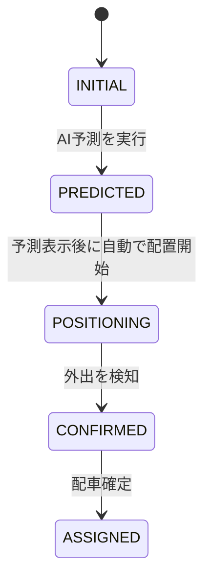

# 機能設計書

## 対象と要件

[要件定義書](product-requirements.md)の差し替え版を基準とする。固定データで予測配置を体験する1画面のデモ。2026-09-13にMustと本書のShouldを実装した。確認結果は[実装検証記録](implementation-validation.md)を参照。

第33章のMustと第39章のAC-01〜AC-09が完成の中心。第34章のShouldは追加実装時の契約として記載する。将来の即時配車、予約入力、実センサー、実AI、交通運行は今回の処理に含めない。

ボタンを押す人はデモの操作者。山田さんが予約や配車操作をしたことにはしない。実サービスの自動イベントを、操作者が3つのボタンで進める。

## 単一画面の契約

- 街・車両領域：CSSの模式図に自宅、○○病院、山田さん、Vehicle-03を表示。待機地点・自宅周辺・利用者位置を視覚的に区別する。
- 利用者予定領域：山田さん、現在地「自宅」、`TODAY`、`10:00`、`○○病院`、`Calendar Event`を固定表示する。
- AI Prediction領域：`AI Mobility Prediction`、目的地、予測出発、確率、需要ステータスを表示。初期確率は0%、出発時刻は予測前のみ「—」とする補完案。
- AI Activity Log領域：Shouldを実装する場合に表示。未実装なら空の枠を増やさない。
- 画面下部の操作は「AI予測を実行」「外出を検知」「配車確定」の3つ。モード紹介は「即時配車」「予約配車」「AI予測」の静的な説明とし、新しいボタンや入力画面を設けない（第6章）。
- 予約・エリア需要・予測理由はShould。追加する場合も同じ画面に収める。
- メインメッセージは「呼ぶ、その前に。」。到着時の中央メッセージは「呼んでいない。でも、もう来ている。」とする。改行は可能だが文言を変えない。

固定データによる疑似推定であることを短く示す。ステータスは色だけで区別せず、名称と日本語の意味を併記する設計案。実際の画面サイズ・文字サイズは実装時に会場の表示環境で調整する。

## 状態と操作

`demoPhase`（デモの進行）、`prediction.status`（移動需要の判定）、`vehicle.status`（車両の利用状態）を分離する。同じ `POSITIONING` という文字列でも役割が異なる。

ページ再読み込みは、どの状態からでも新しい `INITIAL` を生成する。次の段階への操作だけを受け付け、後戻り・キャンセル・再予測ボタンは設けない。

### INITIAL

- 確率0%、需要ステータス `LOW`。
- Vehicle-03は `AVAILABLE`、位置は `DEPOT`、割り当て先なし。
- 予定と目的地は表示済み。予測理由・ログ・最終メッセージはまだない。
- 有効な操作は「AI予測を実行」のみ。

### PREDICTED

- 「AI予測を実行」で遷移し、確率82%、予測出発09:28を表示する。
- 82%に対する需要ステータスは `POSITIONING`。画面上では「予測完了」を補足し、車両がすでに割り当て済みだと見せない。
- この段階のVehicle-03はまだ `AVAILABLE`、位置は `DEPOT`、割り当て先なし。
- 次の操作入力を受けず、自動でデモ状態 `POSITIONING` に進む。ボタンを4つに増やさない。
- 補完案：予測結果を描画した後、約300msで配置を開始する。この時間は演出用の調整値であり、ユーザー指定の性能目標ではない。PREDICTEDを省略して直接POSITIONINGに遷移させない。

### POSITIONING

- 確率82%、需要ステータス `POSITIONING`を維持する。
- Vehicle-03を `POSITIONING` に変更し、位置を `AREA_A_NEAR_HOME` にする。
- 割り当て先は引き続きなし。「周辺へ配置中・まだ専用車ではありません」と伝える。自宅周辺へ到達しても車両状態はこのままとする。
- 「外出を検知」のみ有効。Shouldの移動演出を実装した場合は、周辺への到着後に有効にする補完案。
- 山田さんが外出しなかった場合の別需要への転用は説明だけとし、分岐処理や別利用者への割り当ては実装しない。

### CONFIRMED

- 「外出を検知」で確率82%から98%へ変更し、需要ステータスを `CONFIRMED` にする。
- 「移動を検知しました」を表示する。センサーへの接続や位置情報の許可要求は発生しない。
- Vehicle-03は周辺で `POSITIONING`、割り当て先なしを維持する。
- 「配車確定」のみ有効。98%になっただけでは車両を `ASSIGNED` にしない。

### ASSIGNED

- 「配車確定」でVehicle-03を `ASSIGNED` にし、割り当て先を山田さんにする。
- 位置を `USER_PICKUP` に変更し、車両を山田さんの直前まで移動する。アイコン同士が重なって利用者が見えなくならない配置とする。
- 確率98%、需要ステータス `CONFIRMED`を維持する。98%を根拠なく100%へ変更しない。
- 到着後に中央の最終メッセージを表示する。すべての操作ボタンを無効にする。
- Mustのみでは位置を即時更新して到着を示す。Shouldのアニメーションがあれば完了後にメッセージを表示する。`ARRIVED`、`PICKUP`、`ON_BOARD`を第6のデモ状態として追加しない。

### 不正順序・連打・演出中の操作

補完案：ボタンの無効化に加え、イベント処理でも現在の `demoPhase` を確認する。順序違い・同じイベントの再実行は何も変更せず、ログやタイマーも重複させない。

演出の完了待ちは一時的な表示制御として持ち、デモ状態の種類を増やさない。アニメーションを省略した場合や動きを減らす設定の場合も、次のボタンが使えないまま止まらないようにする。

## 情報と計算の契約

データはJavaScript内の架空の固定値。日付や実時刻、現在位置の取得は行わない。以下の識別子と補助フィールドは実装の補完案。

### User・CalendarEvent

- 山田さん：`id = user-01`、`name = 山田さん`、`location = HOME`、`destination = ○○病院`。
- `calendarEvent` は `time = 10:00`、`destination = ○○病院` の予定を参照する。
- 原文第5章の72歳・週1回通院・バス停まで600mは提供されたペルソナ例。全利用者の実測属性や必須画面項目とはしない。
- AさんはShouldの予約データを説明する固定レコードのみ。操作できる利用者を増やすものではない。

### Prediction

- `userId = user-01`、`destination = ○○病院`、`predictedDeparture = 09:28`。
- `probability` は表示用の整数百分率。初期0、予測82、外出検知98の順に更新する。
- 予測の内訳は予定あり40点、出発まで30分以内20点、同様の外出履歴20点、その他補正2点。`40 + 20 + 20 + 2 = 82` をルールとして再現する。
- 「30分以内」はデモシナリオ上の条件。実行した日の時計で分岐させない。82%はモデル精度の実測値ではない。
- 外出イベントによる98%は別の固定更新値。予測の加点をもう一度行う処理ではない。
- `reason` は予定・残り時間・同様の履歴の3つ。表示はShould。その他補正2点を新しい外部情報源として扱わない。
- 第28章のサンプル `departure` は、第27章のモデル名 `predictedDeparture` に統一する補完案。時刻の値は変えない。

### 需要ステータスの判定（FR-04）

整数0〜100を対象に、0〜49は `LOW`、50〜69は `DETECTED`、70〜89は `POSITIONING`、90〜94は `PREPARED`、95〜100は `CONFIRMED` とする。

デモで到達する値は0・82・98のみ。DETECTEDやPREPAREDの画面を巡回する必要はない。需要がCONFIRMEDであることは割り当て可能という条件であり、MVPの割り当て実行は第21.3章の「配車確定」で行う。第8章の一般的な処理説明と混同しない。

### Vehicle

- `id = Vehicle-03`。MVPで使う車両状態は `AVAILABLE`、`POSITIONING`、`ASSIGNED` の3つ。
- `location` は `DEPOT`、`AREA_A_NEAR_HOME`、`USER_PICKUP` の模式図上の位置。地理座標や道路経路ではない。
- `assignedUserId` を補助フィールドとして設ける案。ASSIGNEDの直前まで `null`、ASSIGNEDで `user-01`。予測配置が専用割り当てでないことをデータでも示す。
- 位置の指定先と画面上の移動演出を分離する。将来のPICKUP・ON_BOARDは今回使用しない。

## Shouldの契約

### 予約需要・需要統合（FR-06・FR-07）

固定予約はAさん、09:30、病院行き、`type = RESERVATION`、`score = 1.00`、`area = Area A`。予測需要は山田さん、09:28、病院行き、`type = PREDICTION`、`score = 0.82`、同じエリアとする。スコアは0〜1で、確率表示の0〜100と混同しない。

予測配置の判断時に予約1件と予測1件を合計し、`1.00 + 0.82 = 1.82`、`HIGH DEMAND`、Vehicle-03をArea Aへ配置、と示す。任意エリア向けのしきい値、人数計算、配車最適化は追加しない。`INSTANT` は将来の需要種別としてのみ保持する。

補完案：初期画面では予約を表示し、AI予測とエリア判定は未実行表示。PREDICTED以降に1.82を示す。外出検知後もこの欄は「予測配置時点の需要」として0.82・1.82を保持する。現在の確率98%と時点を区別し、固定例を1.98へ書き換えたり山田さんを二重計上したりしない。

### AI Activity Log（FR-10）

時計はデモ上の固定時刻。実時間の経過を待たず、イベントごとに次を順番に追加する。

- PREDICTED：09:10 `Calendar event detected / 10:00 ○○病院`、09:11 `Predicted departure / 09:28`、09:12 `Similar trip history detected`、09:13 `Mobility probability / 82%`。
- POSITIONING：09:14 `High demand area detected`、09:15 `Vehicle-03 positioning`。
- CONFIRMED：09:27 `Movement detected / Probability 82% → 98%`。
- ASSIGNED：09:28 `Vehicle-03 Assigned / ETA 1 min`。

計8件。Shouldの需要欄が未実装でも、High demandは固定シナリオの説明として表示できる。ETAは割り当て時点のデモ値であり、1分待つタイマーや実測到着予報ではない。再読み込みで空になり、連打で増殖しない。

### 車両移動アニメーション（FR-11）

追加した場合、周辺配置と利用者への移動をそれぞれ約1〜2秒のCSS transition等で表す（第23章）。操作後1秒以内の変化開始と、演出の完了時間は別の条件。動きを減らす設定では位置更新とテキストで同じ結果を伝える設計案。

### Prediction Reason

予測後に `Calendar event detected`、`Departure within 30 minutes`、`Similar past trip detected` を表示する（第20・34章）。省略しても40+20+20+2の計算と82%表示はMustとして実装する。

## 受け入れ条件との対応

- FR-01 → AC-01：起動時の利用者・予定・目的地を確認する。車両の待機表示も合わせて確認する。
- FR-02・FR-03 → AC-02：予測操作で82%と09:28が表示される。
- FR-04・FR-05 → AC-03・AC-04：PREDICTEDを経て周辺配置されるが、車両は未割り当てのまま。
- FR-08・FR-04 → AC-05・AC-06：外出操作で98%と需要CONFIRMEDになり、車両は未割り当てのまま。
- FR-09 → AC-07・AC-08：配車操作でASSIGNEDとなり、利用者位置に到着する。
- 第31・33章 → AC-09：到着後に指定の最終メッセージを表示する。
- FR-06・FR-07・FR-10・FR-11と予測理由はShould。採用したものを[開発ガイドライン](development-guidelines.md)の追加確認で検証する。
- NFR-01〜NFR-05は同ガイドラインで、応答開始、オフライン、再読み込み、30秒説明、外部API非依存を検証する。

## 補完案と未決定事項

PREDICTEDの表示時間、無効な操作の扱い、アニメーション中のボタン制御、需要の集計時点、補助データ項目は本設計の補完案であり、ユーザーの原文に追加された確定要件ではない。

本書の補完案を採用し、PREDICTEDは300ms、車両移動は1.6秒、演出終了の補完タイマーは1.75秒とした。Shouldは全5項目を実装。Chrome・Edgeでの検証条件は[実装検証記録](implementation-validation.md)に記載する。会場のPC・ブラウザー・画面解像度は引き続き未確認。
